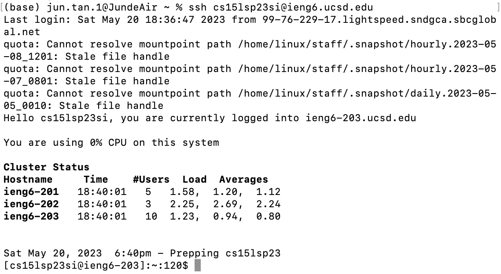
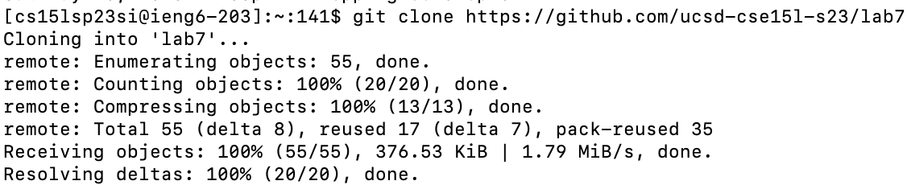
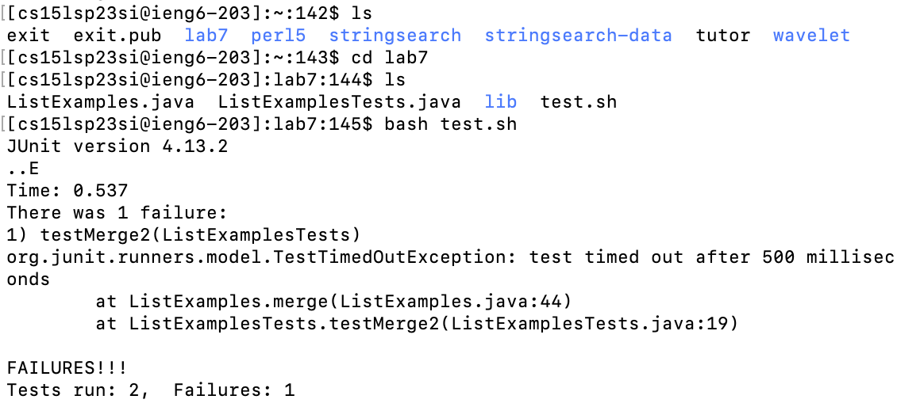
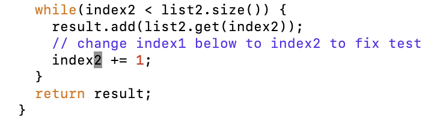
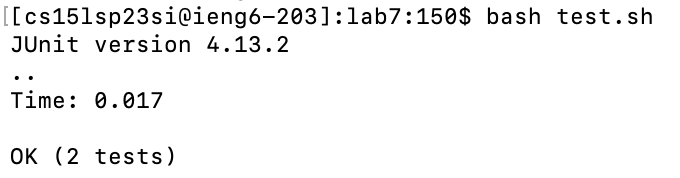
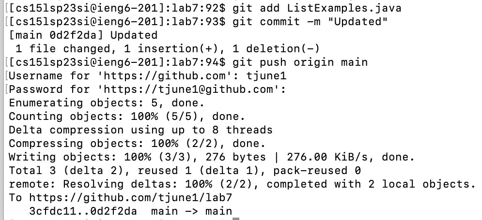

# Fourth Lab Report - Jun T.
In this lab report, for steps 4-9, I will summarize the commands I ran and what the effect of keypresses were.

**Step 4: Log into ieng6**
  

  
To log into ieng6, I typed the command `ssh cs15lsp23si@ieng6.ucsd.edu` and then pressed the key `<return>` to execute the command. Since in lab we're required to do the step "Generating SSH Keys for ieng6," I don't need to be prompted for entering a password anymore. 

**Step 5: Clone your fork of the repository from your Github account**
  

  
To clone my fork of the repository from my Github account. I first typed `ctrl-c` to copy the url of the repository from my Github account. Then, I typed `git clone` and keys `<space> <ctrl-p> <return>` to paste the url of my repository as well as execute the command.

**Step 6: Run the tests, demonstrating that they fail**
  

To run the tests, I first typed the command `ls` to check the repository is cloned correctly from step 5, and then I typed `cd lab7` and `ls` to go into the correct directory and see what files do the direcotry lab7 contains. Then, I typed `bash test.sh` to run the test. I clicked the key `<return>` after each command to execute it. The result shows that the tests fail.
  
**Step 7: Edit the code file to fix the failing test**
  

To edit the code file, I first typed `vim ListExamples.java` and pressed the key `<return>` to open and edit ListExamples.java file in the Vim text editor. Then I typed `/while(index2<return>jjj2whh` to move the cursor to the word that I want to edit. Then I typed `xi2<esc>` to change `index1` to `index2` and exit the insert mode. Then I typed `:wq` to save changes to the file and exit Vim.  

**Step 8: Run the tests, demonstrating that they now succeed**

  
  
I typed `bash test.sh` and pressed `<return>` to run the tests. The result shows the tests are succeeded now.
  
**Step 9: Commit and push the resulting change to your Github account**

I typed `git add ListExamples.java` and pressed `<return>` first to include the changed file in the next commit. Then I typed `git commit -m "Updated"` and pressed `<return>` to save the changes to the repository with the commit message "Updated". Then I typed `git push origin main` to push the main branch to the remote repository. Then I typed my username from github and password to finish the push.
